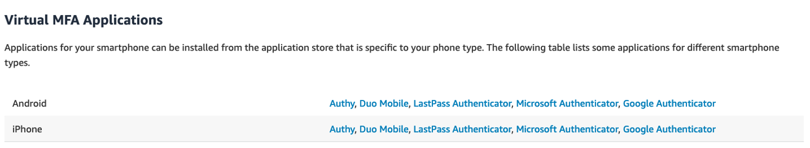
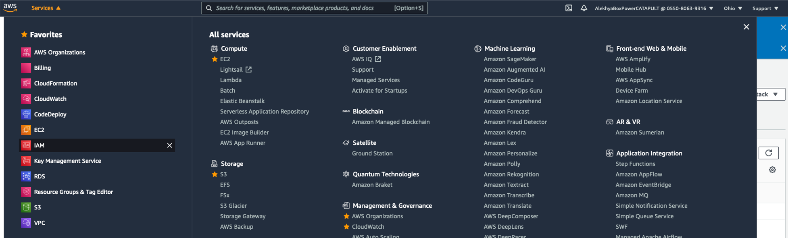
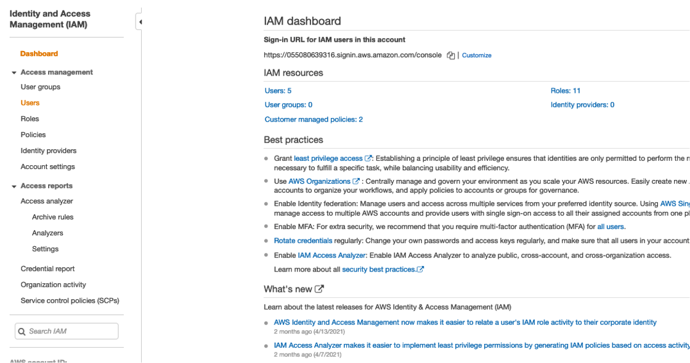
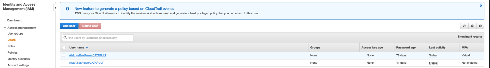
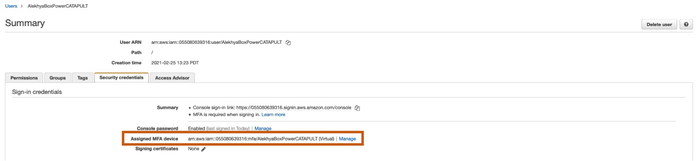
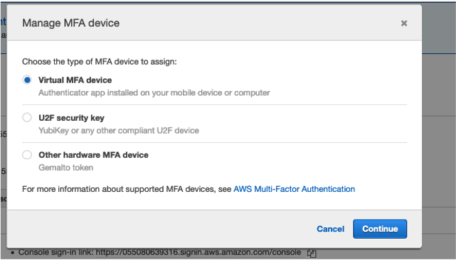

## Purpose
The document is meant to be used by a developer to needs to enable Multi-Factor Authentication in their AWS account. It is assumed that they have the credentials to login to their account.

## Steps
1. Download anyone of the applications listed below on your Android or Apple phone.


2. Login to your AWS account with the given credentials.

3. Under ```Services```, navigate to ```IAM```.


4. From the menu on the left, select ```Users```.


5. Select your ```User name``` from the list.


6. Select the ```Security credentials``` tab. Under the tab, select the ```Manage``` button beside the ```Assigned MFA device``` option.


7. Select ```Virtual MFA device``` and follow the instructions on the screen.


You will be asked to - Scan a QR code shown on the screen using the Authenticator app installed in Step1. Once linked via QR code, you will need to put in two six digit codes that will be shown on your Authenticator app into the pop up.
